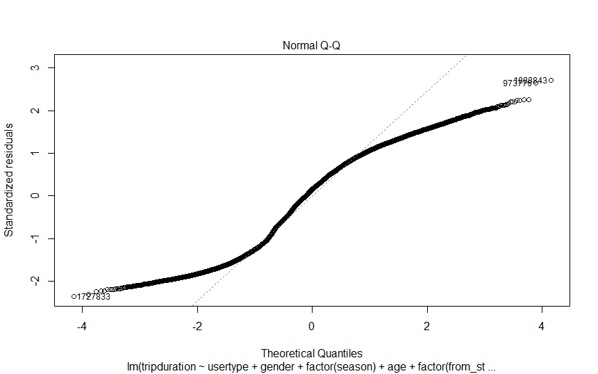

```{r setup, include=FALSE}
knitr::opts_chunk$set(echo = TRUE)
```

## Linear Model

Linear regression is an approach to identify linear relationship between a response and explanatory variables. We use linear regression to start an exploratory research so as to identify significant predictors. 

$$tripduration=X\beta+\varepsilon,\ \varepsilon\sim N(0,\sigma^2)$$

### Memory issue

Our design matrix $X$ is of dimension $1490516\times 653$ due to the presence of categorical variables, which is too large to fit the matrix in the memory. When fitting the model, we were not able to fit the model by `lm()` function. We solve this problem by using the bigmemory package.

### Memory issue (Another solution)

Using the K-mean method (will be introduced later) is another way to solve the Memory issue, which is to group the stations by their distance and reduce the number of dummy variables. When that is achieved, the design matrix will be thinner and able to put in memory.

The final model has an $MSE=52.23$

### Constant Variance issue

Let's have a look at the qqplot:

As we can see, the normality assumption seems violated in the model, so we decided to use transformation to fix the problem, we finally chose the square root function. 

### Results

Even after fixing the transformation, the $MSE=40.58$ is still unsatisfactory, which means linear model may not be a perfect fit for this problem, so we decide to switch to other advanced non-parametric machine learning models. 