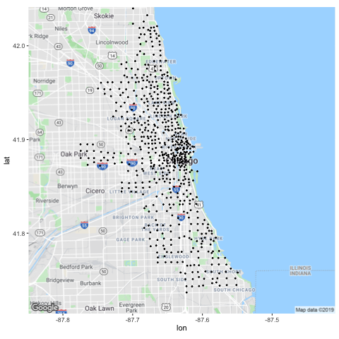
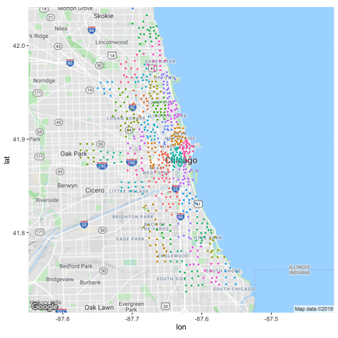
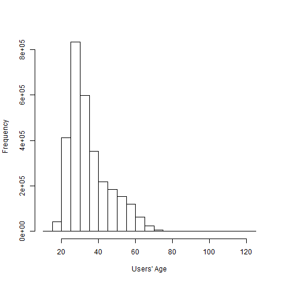
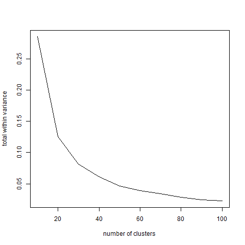
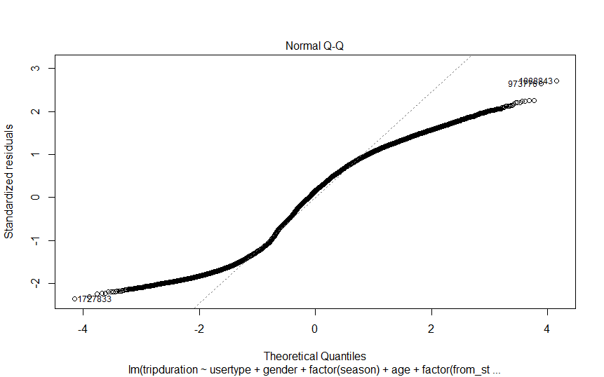

[Here is our project repository on Github](https://github.com/BangyaoZhao/divvy).

All three authors had equal contributions. Xuemei, Bangyao, and Sunyi contributed to data preprocessing, Bangyao contributed to the linear regression model, Xuemei contributed to K means clustering, Sunyi contributed to map plots, Sunyi, Bangyao, and Xuemei contributed to machine learning models with cluster and parallel computing, and Sunyi and Bangyao contributed to the shiny app.

# Introduction
Bicycle sharing programs are getting popular today. They offer a convenient and affordable way to get around the city for both residents and tourists. Riding a bicycle is a fun exercise, and it is an environment-friendly way of transportation.

The Divvy Bikes is a bicycle sharing program in Chicago, Illinois. 6,133 bicycles can be rented from and returned to 621 stations. Given that the number of bicycles at each station is relatively limited, it is meaningful to predict the renting time of each bicycle to reasonably arrange the resting bicycles.

Our project aimed to predict the trip duration time of each Divvy Bike trip at its start, using a set of covariates that can be obtained including information of the trip itself (start time and place) and the user (gender, age, and membership type).

# Data Description and Pre-processing

## Data Description 
The dataset we used was the Divvy data set, which contained Divvy Bikes’ using information in 2018. 3,603,082 samples (trips) were recorded. For each trip, there was information of start and end time and station, as well as information of the user. The original variables are listed in Table 1. Figure 1 shows a map of all the stations.

Table 1: original variables in the Divvy Bikes data
---------------------------------
Variable name    | Variable label
-----------------|---------------
trip_id          | trip ID
tripduration     | end_time - start_time, in minutes.
Age              | age of the user
from_station_id  | the ID of the station where the trip starts. There were 621 different stations.                              
from_station_name| name of the station where the trip started
usertype         | user type, either "Subscriber" (Annual Members) or "Customer" (users who bought a single ride or a one-day pass)
Gender           | gender of the user
start_time       | start date and time of the trip


{width=200px}
{width=200px}
{width=200px} 

## Variable Transformation
To make full use of the variables, we extracted three variables from the original $start\_time$, as shown in Table 2.

Table 2: extracted information from $start\_time$
---------------------------------
Variable name    | Variable label
-----------------|---------------
Season           | in which season the trip took place. Winter: Dec. - Feb., Spring:  Mar. - May, etc.
hour             | in which time slot of a day the trip took place
weekends         | indicator of whether the trip happened on weekends

To reduce the dimension of the categorical variable $from\_station\_name$, we searched for information of the stations on the Divvy Bikes webpage and found ID, name, latitude, longitude, and number of bikes (variable name $Docks.in.Service$) for 611 stations.

Based on these data, we used the K-means clustering method to partition the stations by their locations. We first partitioned the stations into 10, 20, ..., 100 clusters (K = 10, 20, ..., 100) and calculated the total within cluster variance for each K. Then we  plotted the total within cluster variance against K and selected an optimal K by minimizing the total within cluster variance with a smallest K. Figure 2 shows the plot of total within cluster variance with K from 10 to 100.

{width=200px}

The total within cluster variance decreases sharply at first, but after K larger than 40, it becomes relatively steady. So we set K = 40, run the K-means clustering method, and partitioned the stations into 40 distinct, non-overlapping clusters. The clustering results are displayed in Figure 3.


{width=200px}

## Data Cleaning and partition
In the Divvy Bikes data, 562,565 out of 3,603,082 trips did not have user's age or gender information and we deleted these. 2 out of 621 stations did not have any trips left after this step. Among the 3,040,517 remaining trips, some had very short duration time and were unlikely to be normal trips, so we deleted 34,849 trips that were shorter than half a minute ($tripduration < 0.5$). We also noticed that some users had an implausibly large age, some users being older than 100. We drew a histogram of all users' age, as shown in Figure 4.


From Figure 4, we can see that there are very few people older than 75, so we further deleted these people. In this step, 2,407 out of 3,005,668 trips were deleted.

To make use of the station information we found on the Divvy Bikes website, we only wanted to include stations in the station table, so we excluded the trips starting from stations other than the 611 stations which we had location and scale information. 17 out of 619 stations were excluded, which resulted in the deletion of 622 trips. 

After data cleaning, we ended with a data set of 3,002,639 trips.

We divided the data set equally into two parts, training data (1,501,319 trips) and testing data (1,501,320 trips).


# Approach and Results

## Linear Model

 We started with the linear regression as an exploration. 

### Memory issue

Our design matrix $X$ is of dimension $1490516\times 653$ due to the presence of categorical variables, which is too large to fit in the memory. Therefore, we were not able to fit the model by `lm()` function. We solved this problem using the bigmemory package.

Another way to solve the Memory issue is to reduce dimension. We used the K-mean clustering method to group the stations by their distances and reduced the number of dummy variables. In this way, the design matrix became smaller and was able to fit in the memory. The model with cluster ID instead of station ID as a dummy variable had an $RMSE=33.67$.

### Constant Variance issue

As we can see from Figure 5, the normality assumption seemed to be violated in the model, so we decided to use a transformation to fix the problem and chose the square root transformation. 

### Results

Even after fixing the transformation, the $RMSE=33.39$ was still unsatisfactory. A linear model might not be a perfect fit for this problem, so we decided to switch to other advanced non-parametric machine learning methods. 

## Non-parametric Model and parallel computing in clusters

Due to the memory limitation, we first tried a single tree model rpart, the Recursive Partitioning and Regression Trees model, to predict the duration of customers using Divvy Bikes. We used 20 cores to compute in parallel and used the 5-fold cross validation to choose the best model. The procedure took one and a half hours. Since the single tree model was not good enough, we then used the ensemble tree models random forest and tree bag, and also knn and SVM with the radial kernel. At first, we set memory as 50 GB in the cluster but an out-of-memory issue came up. A trade-off was that the more cores we used, the faster the programs would finish, but the more memory we would need. Therefore, we used 150 GB memory and still used 20 cores. 
Fitted models are saved in  [our mbox folder](https://umich.box.com/s/wok9fln0bzn3y0dgja57xrscjbqkt33s). 


### Prediction Results shown in interactive web apps

We predicted the trip duration time of testing data with our fitted models and compared their RMSE. Due to a limit of time, we only used rpart (single tree) and rf (random forest) to perform prediction in the testing data.  Page 5 shows a bar plot of RMSE in testing data of all methods and our shiny app's UI. The RMSEs of non-parametric methods are slightly smaller than the RMSE of the linear model, which shows  an improvement. One limitation of our project is that we didn't have enough computing resource to tune parameters by cross validation. So the results are based on the default parameters in R package caret. 


```{r, echo = F}
library(ggplot2)
df=data.frame("Methods"=c("rpart", "rf"),"RMSE"=c(33.92, 33.10))
ggplot(data=df) +
  geom_bar(aes(x=Methods, y=RMSE), position = "dodge", stat="identity",data=df)+
  labs(y="RMSE",title ="Predicted RMSE")
```

{width=550px}


