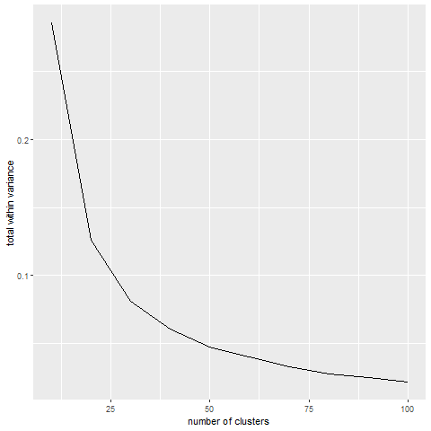

```{r include=FALSE}
library(bigmemory)
library(biganalytics)
```
The report is clearly written and sufficiently introduces the dataset of choice, the question of interest, the approach taken, and the results.
# Introduction
Bicycle sharing programs are getting popular today. They offer a convenient and affordable way to get around the city for both residents and tourists. Riding a bicycle is a fun exercise, and it is an environment-friendly transportation.

The Divvy Bikes is a bike sharing program in Chicago, Illinois. 6,133 bicycles can be rented from and return to 621 stations. Given that the number of bicycles at each station is relatively limited, it is meaningful to predict the renting time of each bicycle so as to reasonably arrange the resting bicycles.

Our project aims to predict the trip duration time of each Divvy Bike trip in 2018 using a set of covariates that can be abtained at the start of the trip, including information of the trip itself (time and start place) and the user (gender, age, and membership type).

# Data Description and Pre-processing

## Data Description 
The dataset we used was the Divvy data set, which contained Divvy Bikes’ using information in 2018. 3,603,082 samples (trips) were recorded. For each trip, there was information of start and end time and station, as well as information of the user. Figure 1 shows a map of all the stations.


The original variables are listed in the table below:

Variable name    | Variable label
-----------------|---------------
trip_id          | trip ID
tripduration     | end_time - start_time, in minutes.
Age              | age of user
from_station_id  | ID of the station where the trip starts. There are 620 different stations.                              
from_station_name| name of the station where the trip starts. There are 620 different stations.                              
usertype         | user type. Can be either subscriber (Annual Members) or customer (users who bought single ride or one-day pass)
Gender           | gender of the user
start_time       | start date and time of the trip

## Variable Transformation
To make full use of the variables, we extracted three variables from the original $start\_time$, as shown below:

Variable name    | Variable label
-----------------|---------------
Season           | in which season the trip took place. Winter: Sept. - Feb., Spring:  Mar. - May, etc.
Start_time_cat   | in which time slot of a day the trip took place
weekends         | indicator of whether the trip happens on weekends

To reduce dimension of the categorical variable $from\_station\_name$, we searched for information of the stations on the Divvy Bikes webpage and found data for all the stations, where we had:
Variable name    | Variable label
-----------------|---------------
ID               | ID of the station
Station.Name     | name of the station
Latitude         | latitude of the station
Longitude        | longitude of the station
Total.Docks      | number of bikes at this station

Based on these data, we used K-means clustering method to partition the stations into 40 distinct, non-overlapping clusters. We first partitioned the stations into 10, 20, ..., 100 clusters (K = 10, 20, ..., 100) and caculated the total within cluster variance for each K. We then plotted the total within cluster variance against K, as shown in Figure 2.



The total within cluster variance decreases sharply at first, but after K larger than 40, it becomes relatively steady. So we set K = 40, run the K-means clustering method, and obtained a cluster ID for every station, where there were 40 unique cluster ID.
## Data Cleaning
We first deleted data with user age or gender missing. 562,565 out of 3,603,082 trips were deleted. We also noticed 2 out of 621 stations did not have any trips left.

Among the 3,005,668 remaining trips, some had very short duration time and were unlikely to be normal trips, so we deleted trips that were shorter than half a minute ($tripduration < 0.5$). 34,849 trips were deleted in this step.

We also noticed that some 
# Approach and Results

## Linear Model

Linear regression is an approach to identify linear relationship between a response and explanatory variables. We use linear regression to start an exploratory research so as to identify significant predictors. 

$$tripduration=X\beta+\varepsilon,\ \varepsilon\sim N(0,\sigma^2)$$

### Memory issue

Our design matrix $X$ is of dimension $1490516\times 653$ due to the presence of categorical variables, which is too large to fit the matrix in the memory. When fitting the model, we were not able to fit the model by `lm()` function. We solve this problem by using the bigmemory package.

After successfully fitting the model, we looked at the residual plot

### Constant Variance issue

Let's have a look at the qqplot:

As we can see, the normality assumption seems violated in the model, so we decided to use transformation to fix the problem, we finally chose the square root function. 

### Results

Even after fixing the transformation, the $R^2=0.058$ is still unsatisfactory, which means linear model may not be a perfect fit for this problem, so we decide to switch to other advanced non-parametric machine learning models. 

## K-mean method

Another method to overcome the computational challenge

## Non-parametric Model and parallel computing in cluster


#Results
## Prediction Results


## Interactive web apps


