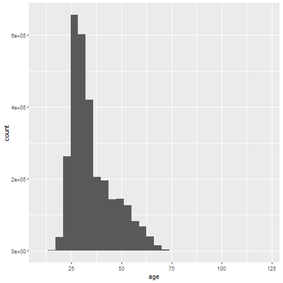

Github link of our project: https://github.com/BangyaoZhao/divvy 

All three authors had equal contributions. Xuemei, Bangyao and Sunyi contributed to data preprocessing, Bangyao contributed to the linear regression model, Xuemei contributed to K means clustering, Sunyi contributed to map plots, Sunyi, Bangyao, and Xuemei contributed to machine learning models with cluster and parallel computing, and Sunyi and Bangyao contributed to the shiny app.

# Introduction
Bicycle sharing programs are getting popular today. They offer a convenient and affordable way to get around the city for both residents and tourists. Riding a bicycle is a fun exercise, and it is an environment-friendly transportation.

The Divvy Bikes is a bicycle sharing program in Chicago, Illinois. 6,133 bicycles can be rented from and return to 621 stations. Given that the number of bicycles at each station is relatively limited, it is meaningful to predict the renting time of each bicycle so as to reasonably arrange the resting bicycles.

Our project aims to predict the trip duration time of each Divvy Bike trip in 2018 using a set of covariates that can be abtained at the start of the trip, including information of the trip itself (time and start place) and the user (gender, age, and membership type).

# Data Description and Pre-processing

## Data Description 
The dataset we used was the Divvy data set, which contained Divvy Bikes’ using information in 2018. 3,603,082 samples (trips) were recorded. For each trip, there was information of start and end time and station, as well as information of the user. Figure 1 shows a map of all the stations.

{width=200px}


The original variables are listed in Table 1.


Table 1: original variables in the Divvy Bikes data
---------------------------------
Variable name    | Variable label
-----------------|---------------
trip_id          | trip ID
tripduration     | end_time - start_time, in minutes.
Age              | age of the user
from_station_id  | ID of the station where the trip starts. There were 621 different stations.                              
from_station_name| name of the station where the trip started
usertype         | user type, either "Subscriber" (Annual Members) or "Customer" (users who bought a single ride or a one-day pass)
Gender           | gender of the user
start_time       | start date and time of the trip

## Variable Transformation
To make full use of the variables, we extracted three variables from the original $start\_time$, as shown in Table 2.

Table 2: extracted information from $start\_time$
---------------------------------
Variable name    | Variable label
-----------------|---------------
Season           | in which season the trip took place. Winter: Dec. - Feb., Spring:  Mar. - May, etc.
Start_time_cat   | in which time slot of a day the trip took place
weekends         | indicator of whether the trip happened on weekends

To reduce dimension of the categorical variable $from\_station\_name$, we searched for information of the stations on the Divvy Bikes webpage and found ID, name, latitude, longitude, and number of bikes (variable name $Docks.in.Service$) for 611 stations.

Based on these data, we used K-means clustering method to partition the stations by their locations. We first partitioned the stations into 10, 20, ..., 100 clusters (K = 10, 20, ..., 100) and caculated the total within cluster variance for each K. Then we  plotted the total within cluster variance against K and selected an optimal K by minimizing the total within cluster variance with a smallest K. Figure 2 shows the plot of total within cluster variance with K from 10 to 100.

{width=200px}

The total within cluster variance decreases sharply at first, but after K larger than 40, it becomes relatively steady. So we set K = 40, run the K-means clustering method, and partitioned the station into 40 distinct, non-overlapping clusters. The clustering results are displayed in Figure 3.


{width=300px}


## Data Cleaning
We first deleted data with user's age or gender missing. 562,565 out of 3,603,082 trips were deleted. We also noticed 2 out of 621 stations did not have any trips left after this step.

Among the 3,040,517 remaining trips, some had very short duration time and were unlikely to be normal trips, so we deleted trips that were shorter than half a minute ($tripduration < 0.5$). 34,849 trips were deleted in this step.

We also noticed that some users had implausibly large age, some users being older than 100. We drew a histogram of user's age, as shown in Figure 4.

{width=200px}

From Figure 4, we can see that there are very few people older than 75, so we further deleted these people. In this step, 2,407 out of 3,005,668 trips were deleted.

To make use of the station information we found on the Divvy Bikes website, we only wanted to include stations in the station table, so we excluded the trips starting from stations other than the 611 stations which we had location and scale information. 17 out of 619 stations were excluded, which resulted in the deletion of 622 trips. 

After data cleaning, we ended with a data set of 3,002,639 trips.

## Data Partition
We divided the data set equally into two parts, training data (1,501,319 trips) and testing data (1,501,320 trips).


# Approach and Results

## Linear Model

Linear regression is an approach to identify linear relationship between a response and explanatory variables. We use linear regression to start an exploratory research so as to identify significant predictors. 

### Memory issue

Our design matrix $X$ is of dimension $1490516\times 653$ due to the presence of categorical variables, which is too large to fit the matrix in the memory. When fitting the model, we were not able to fit the model by `lm()` function. We solve this problem by using the bigmemory package.

Using the K-mean method is another way to solve the Memory issue, which is to group the stations by their distance and reduce the number of dummy variables. When that is achieved, the design matrix will be thinner and able to put in memory. Then the model has an $MSE=52.23$

### Constant Variance issue

{width=200px}

As we can see from Figure 5, the normality assumption seems violated in the model, so we decided to use transformation to fix the problem, we finally chose the square root function. 

### Results

Even after fixing the transformation, the $MSE=40.58$ is still unsatisfactory, which means linear model may not be a perfect fit for this problem, so we decide to switch to other advanced non-parametric machine learning models. 

## Non-parametric Model and parallel computing in cluster

Due to the memory limitation, we first try a single tree model--rpart, which is Recursive Partitioning and Regression Trees, to predict the duration of customers using Divvy bike. We used 20 cores to compute in parallel and used 5-fold cross validation to choose the best model. The procedure costs one and a half hours. The MSE is 1143, which is worse than linear model. Since single tree model is not good enough, we then used ensemble tree model random forest, tree bag and also knn, SVM with radial kernel. At first, we set memory as 50 GB in cluster but out of memory issure came up. Then we used 150 GB memory and still used 20 cores. Fitted models are saved in  mbox: https://umich.box.com/s/wok9fln0bzn3y0dgja57xrscjbqkt33s. 


### Prediction Results shown in interactive web apps

We fitted models on testing data and compare there MSE.

```{r}
library(ggplot2)
df=data.frame("Methods"=,c(),"MSE"=c())
ggplot(data=df) +
  geom_bar(aes(x=Methods, y=MSE), position = "dodge", stat="identity",data=df)+
  labs(y="MSE",title ="Predicted MSE")
```


